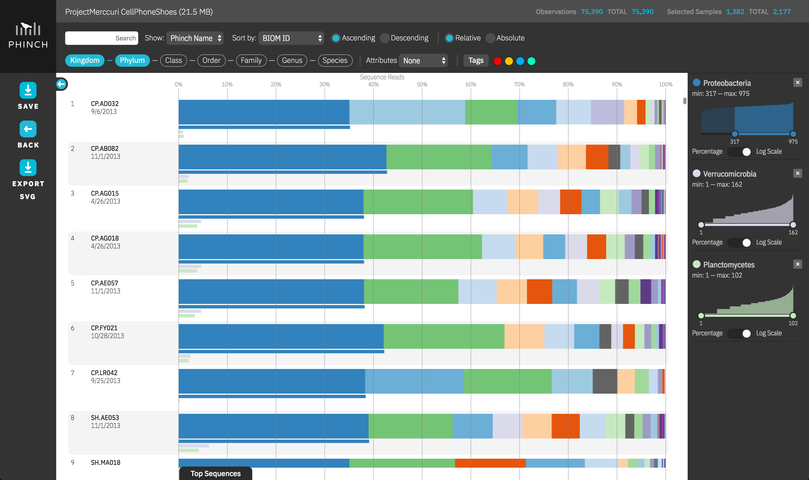

# 


## About

[](https://gitter.im/Phinch2/Lobby?utm_source=badge&utm_medium=badge&utm_campaign=pr-badge&utm_content=badge)

Phinch is a data visualization framework aimed at promoting novel explorations of large biological datasets (microbiomes, metagenomes, etc.). Phinch 2.0 has now been relaunched as a standalone desktop application, compatible with Mac OS X, Windows, and Linux operating systems. New features include support for HDF5 and JSON BIOM files, retooled visualizations, improved image export and sharing, and the ability to work offline.

Phinch is an open-source framework for visualizing biological data, funded by a grant from the Alfred P. Sloan foundation. This project represents an interdisciplinary collaboration between Pitch Interactive (a data visualization studio in Oakland, CA; [https://pitchinteractive.com](https://pitchinteractive.com)) and biological researchers at UC Riverside (Principal Investigator: Dr. Holly Bik, [https://www.biklab.org](https://www.biklab.org)).


## Development

### Install

First, clone the repo via git:

```bash
git clone https://github.com/PhinchApp/Phinch.git your-project-name
```

Then install dependencies with yarn or `npm install`.

```bash
$ cd phinch
$ yarn
```

To keep the main thread responsive, we use workers for some tasks. They have their own dependencies and package.json. To install:

```bash
$ cd workers
$ yarn
```

Finally, there's an *optional* step that can be a little tricky. Phinch uses a python script in the  `biomhandler` folder to load hdf5 biom files. To make Phinch easy to install, we use PyInstaller to package that script into a standablone executable. We've included prepacked versions for macOS and Windows in the Phinch repository. If you'd like to create your own version of the biomhandler executable, follow the build steps listed in that project's repository [here](https://github.com/PhinchApp/biomhandler), and place the result in the `biomhandler/` folder.

### Run
```bash
$ npm run dev
```

### Packaging

Package apps for the local platform with:

```bash
$ npm run package
```

### Good to Know

Phinch's performance will depend on your system, but in general large biom files may take time to load. Files with a large number of selected samples (more than `500`) may be sluggish in the filter and visualization views. Please be patient when working with large files, or consider pre-filtering your data for visualization.

### Flagship datasets


We've collected 3 [flagship datasets](https://github.com/PhinchApp/datasets) for new users to try out Phinch's capabilities. 


## Community

### Mozilla Global Sprint: Round 5 of Mozilla Open Leaders


[Mozilla Open Leaders information](https://mozilla.github.io/leadership-training/round-5/projects/)

### Code of Conduct

Check out our [Code of Conduct](/CONDUCT.md)

### Contribution Guidelines

Check out our [Contribution Guidelines](/CONTRIBUTING.md)

### License
The BSD 2-Clause License

* * *


